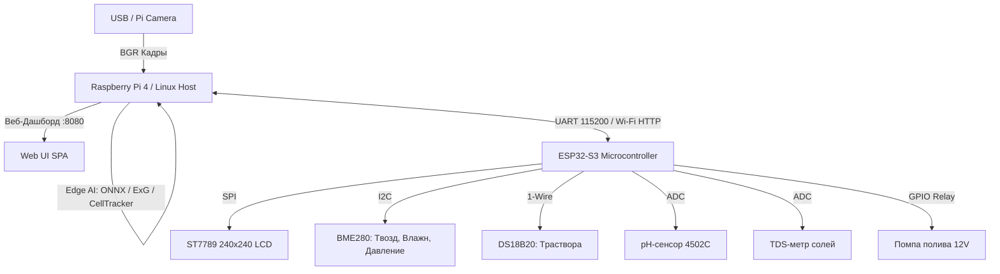

# 🌱 AgroHomeSystem — Контекст проекта и техническое резюме (AI Context)

> **Назначение файла:** Этот документ содержит исчерпывающее описание архитектуры, аппаратной части, нейросетевых моделей, протоколов связи, компьютерного зрения и истории разработки **AgroHomeSystem**. Создан для мгновенного погружения AI-ассистента в контекст проекта в любой последующей сессии.

---

## 📌 1. Обзор проекта
**AgroHomeSystem** — это автономный умный домашний гидропонный инкубатор-гроубокс с гибридным AI-управлением (Edge AI на Raspberry Pi 4 + Real-time контроллер ESP32-S3).

### Ключевая концепция:
- **Периферийный ИИ (Edge AI):** Камера сверху лотка диагностирует болезни, фазы роста, биомассу и здоровье каждой отдельной ячейки в реальном времени без облака.
- **Инкубатор v2 (Корпус 2026):** Переработанный лоток на **24 индивидуальные ячейки** (сетка $4 \times 6$) под стандартные цилиндрические пробки из минеральной ваты **22 мм** (`Корпус нижняя часть v2.stp`, `Ячейки.stp`).
- **Тамагочи-компаньон:** Растение на цветном экране инкубатора и в веб-дашборде реагирует эмоциями на микроклимат, полив и заботу пользователя.

---

## 🏗️ 2. Аппаратная архитектура (Hardware Stack)



### 1. Вычислительный узел (Raspberry Pi 4 / Mini-PC):
- **ОС:** Raspberry Pi OS (Debian Linux) / Windows для разработки.
- **Движок AI:** Python 3.11+, OpenCV 4.10+, ONNX Runtime (ARM NEON оптимизация), NumPy.
- **Веб-сервер:** Многопоточный HTTP-сервер на Python (`demo/web_dashboard.py`, порт `8080`), MJPEG видеостриминг, REST API.

### 2. Контроллер автоматики и сенсоров (ESP32-S3):
- **Микроконтроллер:** ESP32-S3 (8MB Flash, Wi-Fi 2.4GHz + BLE 5.0).
- **Фреймворк:** PlatformIO + Arduino Core (`firmware/platformio.ini`, `firmware/src/main.cpp`).
- **Беспроводная прошивка (Dual OTA):**
  1. **Web OTA (`/update`):** Прошивка через веб-браузер с отображением прогресс-бара прямо на экране ST7789.
  2. **ArduinoOTA (порт 3232):** Прямая заливка из PlatformIO / CLI (`pio run -t upload --upload-port <IP>`).
- **Сенсоры:**
  - `BME280` (I2C: SDA=8, SCL=9) — температура воздуха, относительная влажность, атмосферное давление, расчет дефицита упругости водяного пара (**VPD** в кПа).
  - `DS18B20` (1-Wire: GPIO 4) — температура питательного раствора в баке.
  - `pH Sensor 4502C` (ADC: GPIO 1) — кислотность раствора (норма 5.5 - 6.8).
  - `TDS Meter` (ADC: GPIO 2) — минерализация/солесодержание (ppm).
- **Исполнительные механизмы:**
  - Реле помпы полива (GPIO 5).
  - Дисплей ST7789 1.3" / 1.54" IPS (SPI: MOSI=11, SCLK=12, CS=10, DC=13, RST=14).

---

## 🌿 3. Поячеечный трекинг и Computer Vision (`demo/cell_tracker.py`)

### 1. Архитектура матрицы ячеек v2:
- **Размерность:** 24 ячейки (сетка 4 колонки $\times$ 6 рядов: `A1..A4`, `B1..B4`, ..., `F1..F4`).
- **Субстрат:** Цилиндрические пробки из минеральной ваты 22 мм (желтого/соломенного цвета).

### 2. Спектральное разделение (Spectral Masking):
- **Желтая минеральная вата (Rockwool Substrate):**
  $$H \in [16..46], \quad S \in [20..200], \quad V \in [65..255], \quad \text{ExG} < 24$$
  *Важно:* Минвата не является живой тканью, поэтому имеет низкий $\text{ExG} = 2G - R - B$. При ее наличии ячейка маркируется как `🟡 ROCKWOOL` (готово к посеву) со 100% здоровьем, исключая ложный хлороз/плесень.
- **Зеленая активная листва (Chlorophyll):**
  $$H \in [30..92], \quad \text{ExG} \ge 20$$
- **Хлороз листвы (Chlorosis):**
  $$H \in [18..32], \quad S > 55, \quad \text{ExG} \ge 25 \quad (\text{только на живой листве})$$
- **Плесень / Серая гниль (Botrytis Mold):**
  $$S < 35, \quad V \in [110..215], \quad \text{ExG} < 15 \quad (\text{без желтого оттенка ваты})$$

### 3. Автообнаружение лотка (`autodetect_tray`):
- При нажатии `🎯 Автопоиск` алгоритм Computer Vision:
  1. Выделяет маску желтых пробок минваты и круглых посадочных лунок.
  2. Находит центры всех пробок через контурный анализ и `cv2.HoughCircles`.
  3. Строит оптимальный охватывающий прямоугольник (ROI) с отступом и центрирует матрицу ячеек прямо под физический лоток.

### 4. Ручная калибровка и персистентность:
- **Модальное окно калибровки:** Ползунки `Y Min`, `Y Max`, `X Min`, `X Max`, `Радиус ячейки`, выбор `Rows`/`Cols`.
- **Инспектор ячейки:** Ручной ввод названия культуры (напр. *"Базилик"*), даты посева, ручного статуса и заметок.
- **Файл конфигурации:** `demo/cell_grid_config.json` (автосохранение и автозагрузка при перезагрузке).

---

## 🧠 4. Нейросетевая диагностика (`demo/plant_health_engine.py`)

- **Архитектура:** MobileNetV2 (Backbone) + Многоголовая классификация (Культура, Болезнь, Степень тяжести, Стадия роста).
- **Спектральный сегментатор:** Индекс Excess Green ($\text{ExG} = 2G - R - B$) + адаптивное пороговое бинаризирование Отсу.
- **Предустановленные пресеты агрокультур (`CROP_PRESETS`):**
  - `watercress` (Кресс-салат / Микрозелень) — pH 6.0-6.8, TDS 400-800, VPD 0.6-0.9 кПа.
  - `basil` (Базилик) — pH 5.5-6.5, TDS 700-1100, VPD 0.8-1.2 кПа.
  - `tomato` (Томат Черри) — pH 5.8-6.5, TDS 1400-2400, VPD 0.8-1.3 кПа.
  - `pepper` (Сладкий перец) — pH 5.8-6.5, TDS 1200-1800, VPD 0.8-1.2 кПа.
  - `strawberry` (Клубника) — pH 5.5-6.2, TDS 600-1000, VPD 0.7-1.1 кПа.
  - `auto` (Автоматическое определение культуры AI).

---

## 📡 5. Протокол связи RPi $\leftrightarrow$ ESP32 (`demo/esp_bridge.py`)

### 1. Формат телеметрии от ESP32 (JSON каждые 1.0 сек):
```json
{
  "ph": 6.25,
  "tds": 840,
  "water_temp": 21.8,
  "air_temp": 23.4,
  "humidity": 58.2,
  "pressure": 1013.2,
  "vpd": 0.88,
  "pump": false,
  "water_low": false,
  "uptime": 3600
}
```

### 2. Команды управления от RPi к ESP32:
- `{"cmd": "pump", "state": true/false}` — включение/выключение полива.
- `{"cmd": "sync_ai", "crop": "Базилик", "diag": "Здорово", "health": 98.0, "stage": 2, "growth": 45.0}` — передача AI-диагностики на TFT-экран.
- `{"cmd": "pet"}` — интерактивное поглаживание растения (анимация сердечка на экране).
- `{"cmd": "reset_sprout"}` — сброс тамагочи-растения на 1 уровень (проросток).

---

## 🌐 6. Веб-дашборд и REST API (`demo/web_dashboard.py`)

- **Порт:** `8080` (доступен локально и по Wi-Fi).
- **Дизайн:** Modern Cyberpunk Emerald / Dark Glassmorphism, адаптивная верстка (мобильные устройства + десктоп).
- **Основные эндпоинты:**
  - `GET /` — Главная страница дашборда (SPA).
  - `GET /video_feed` — Живой MJPEG видеопоток (режимы: `rgb`, `exg`, `split`, `grid` HUD).
  - `GET /api/status` — Полный снимок состояния системы (RPi, ESP32, Plant, Cells, Logs).
  - `GET /api/cells` — Данные всех 24 ячеек (покрытие, хлороз, плесень, минвата, здоровье).
  - `GET /api/cells/config` — Геометрия матрицы и пользовательские переопределения ячеек.
  - `POST /api/cells/config` — Сохранение геометрических параметров матрицы.
  - `POST /api/cells/autodetect` — Computer Vision автопоиск желтых пробок минваты и калибровка ROI.
  - `POST /api/cells/override` — Запись культуры, даты посева, статуса и заметок для конкретной ячейки.
  - `POST /api/cells/clear_override` — Сброс ячейки в авто-режим.
  - `POST /api/cells/reset_config` — Сброс всей матрицы к заводским настройкам (4x6).
  - `POST /api/pump/toggle` — Ручное переключение помпы.
  - `POST /api/crop/preset` — Смена агрономического пресета.
  - `POST /api/video/mode` — Переключение видеорежима (`rgb`, `exg`, `split`, `grid`).
  - `POST /api/plant/pet` — Интерактив (погладить растение).
  - `POST /api/sprout/reset` — Сброс уровня роста ростка.

---

## 🚀 7. Инструкция по запуску на Raspberry Pi

```bash
# 1. Получить актуальную версию из репозитория
cd ~/AgroHomeSystem
git pull origin main

# 2. Установить системные зависимости (если запускается впервые)
pip3 install -r requirements.txt

# 3. Запустить веб-дашборд
cd demo
python3 web_dashboard.py --camera 0 --esp-port auto --port 8080
```

Доступ в браузере: `http://<IP_RPI>:8080` или `http://localhost:8080`.

---

## 📁 8. Структура ключевых файлов проекта

```text
AgroHomeSystem/
├── PROJECT_CONTEXT.md          # Данный файл контекста для ИИ
├── README.md                   # Главный README репозитория
├── demo/
│   ├── web_dashboard.py        # Единый веб-дашборд (HTTP + MJPEG + REST API + SPA)
│   ├── cell_tracker.py         # Трекер 24 ячеек, детекция желтой минваты, автопоиск лотка
│   ├── cell_grid_config.json   # Файл сохраненной калибровки матрицы ячеек
│   ├── plant_health_engine.py  # Нейросетевая диагностика (MobileNetV2 + ExG Segmenter)
│   ├── esp_bridge.py           # Двусторонний мост связи с ESP32-S3 (UART/Wi-Fi)
│   └── test_leaf.jpg           # Тестовое изображение для инференса без камеры
├── firmware/
│   ├── platformio.ini          # Конфигурация сборки PlatformIO для ESP32-S3 (Dual OTA)
│   └── src/
│       └── main.cpp            # Прошивка ESP32-S3 (сенсоры, ST7789 дисплей, Web OTA, помпа)
└── requirements.txt            # Python-зависимости проекта
```
