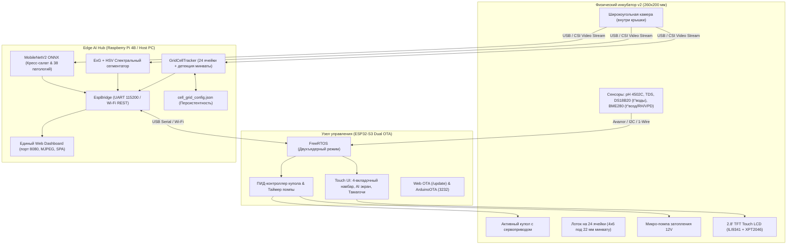

# 🌱 AgroHomeSystem: Автономный модульный агро-инкубатор с машинным зрением

<div align="center">


-00B4D8?style=for-the-badge)


<br/>

**Компактная роботизированная экосистема прецизионного выращивания микрозелени, проращивания семян и черенкования на основе гидропоники периодического затопления, локального сенсорного контроля, спектрального распознавания желтой минеральной ваты и нейросетевой аналитики здоровья растений.**

[О проекте](#-о-проекте) • [Ключевые инновации](#-ключевые-инновации) • [Архитектура](#-архитектура-системы) • [Механика и 3D-конструкция](#-механика-и-3d-конструкция) • [Гидропоника и сенсоры](#-гидропоника-и-сенсорная-подсистема) • [Прошивка ESP32-S3 & OTA](#-прошивка-и-интерфейс-esp32-s3) • [Компьютерное зрение и 24 ячейки](#-компьютерное-зрение-и-edge-ai) • [Быстрый старт](#-быстрый-старт) • [AI Context](#-контекст-для-ии-project_contextmd)

</div>

---

## 📌 О проекте

**AgroHomeSystem** — это автономный программно-аппаратный комплекс (инкубатор), созданный для решения фундаментальных проблем закрытого растениеводства: высоких трудозатрат, нестабильности микроклимата, шума вентиляционных установок и позднего обнаружения болезней растений.

Устройство выполнено в ультракомпактном форм-факторе **260×200 мм** (ревизия корпуса **v2**) и оснащено съемным лотком на **24 изолированные посадочные ячейки** (сетка 4×6) под цилиндрические пробки из **минеральной ваты 22 мм**. В каждой ячейке поддерживается контролируемая корневая и надземная среда.

```
┌────────────────────────────────────────────────────────────────────────┐
│                        AGROHOMESYSTEM ECOSYSTEM                        │
├─────────────────────────┬─────────────────────────┬────────────────────┤
│   🤖 РОБОТИЗИРОВАННЫЙ   │     🌊 ГИДРОПОНИКА     │   👁️ КОМПЬЮТЕРНОЕ  │
│       МИКРОКЛИМАТ       │      EBB & FLOW         │        ЗРЕНИЕ      │
│  ПИД-купол с серво /    │ Автоматическое          │ Поячеечный трекинг │
│  NEMA17 проветриванием  │ периодическое           │ 24 ячеек (4x6) +   │
│  вместо шумных кулеров  │ затопление 24 ячеек     │ детекция минваты   │
├─────────────────────────┼─────────────────────────┼────────────────────┤
│   🖥️ ESP32-S3 TOUCH UI │    📈 ТЕЛЕМЕТРИЯ И VPD  │  ⚡ БЕСПРОВОДНАЯ   │
│  TFT 320x240, 4 вкладки │ pH, TDS, VPD, t° воды,  │   ПРОШИВКА (OTA)   │
│  AI экран, сброс уровня │ t° воздуха, влажность   │ Web /update &      │
│  Тамагочи-питомец       │ и Ebb & Flow таймер     │ ArduinoOTA (3232)  │
└─────────────────────────┴─────────────────────────┴────────────────────┘
```

---

## 💡 Ключевые инновации

### 1. Активный динамический купол с ПИД-проветриванием
В классических гроубоксах используются шумные вентиляторы, создающие сквозняки и сушащие нежные побеги. В **AgroHomeSystem** крышка модуля соединена с сервоприводом высокого крутящего момента. ПИД-регулятор микроконтроллера приоткрывает купол на строго выверенный угол, обеспечивая плавную конвекцию и удаление избытка тепла/влажности без вибраций и шума.

### 2. Прецизионное периодическое затопление 24 ячеек (Ebb & Flow)
Корневая система каждого растения размещается в индивидуальных пробках из минеральной ваты 22 мм в 24 посадочных гнездах. Встроенная микропомпа подает питательный раствор в верхний лоток, равномерно затапливая все 24 ячейки на 15 минут, после чего раствор самотеком сливается обратно в нижний резервуар, естественным образом насыщая корни кислородом.

### 3. Компьютерное зрение и спектральная детекция желтой минеральной ваты
Модуль `demo/cell_tracker.py` оснащен алгоритмами спектрального анализа:
- **Распознавание желтой минеральной ваты (22 мм Rockwool plugs):** субстрат точно идентифицируется по спектру $HSV$ и низкому индексу хлорофилла $\text{ExG} < 24$. Лоток со свежими пробками помечается как `🟡 ROCKWOOL (Готово к посеву)` со 100% здоровьем, исключая ложные тревоги хлороза и плесени.
- **Интеллектуальное автообнаружение лотка (`autodetect_tray`):** алгоритм автоматически находит круглые желтые пробки минеральной ваты на кадре с камеры, вычисляет границы прямоугольника рабочей зоны (ROI) и центрирует матрицу ячеек.
- **Интерактивная калибровка и ручной ввод:** в веб-дашборде доступно модальное окно с ползунками ROI, выбором рядов/колонок, а также карточки ручного редактирования сорта культуры (напр. *"Базилик"*, *"Руккола"*), даты посева и заметок с автосохранением в `demo/cell_grid_config.json`.

### 4. Двухстадийный Edge AI пайплайн диагностики
- **MobileNetV2 Watercress Edition (ONNX ARM NEON):** классификация фаз развития (*Прорастание → Семядоли → Спелая микрозелень*) и патологий (*Черная ножка Pythium, Серая гниль Botrytis, Хлороз Fe/N, Краевой ожог TDS*).
- **Биофизический спектральный сегментатор (ExG + HSV):** расчет площади листового полога (Biomass %), индексов хлорофилла, некроза и очагов плесени.

### 5. Беспроводная прошивка ESP32-S3 (Dual OTA)
Обновление микроконтроллера без подключения кабеля:
1. **Web OTA (`/update`):** Прошивка бинарника через браузер с киберпанк-индикатором и отображением прогресс-бара прямо на экране ST7789.
2. **ArduinoOTA (порт 3232):** Прямая заливка из PlatformIO / CLI (`pio run -t upload --upload-port <IP>`).

---

## 🏗️ Архитектура системы



---

## 📐 Механика и 3D-конструкция

Все механические элементы спроектированы для 3D-печати пластиками PETG / ABS / ASA и доступны в **Компас-3D** и формате **STEP**:

| 3D-модель (STEP в `hardware/cad/step/`) | Назначение детали | Особенности конструкции |
|:---|:---|:---|
| **`Корпус нижняя часть v2.stp`** | Обновленный базовый корпус-резервуар (260×200 мм) | Двойное дно: отсек гидропонного раствора + дренажный уклон, отсек электроники и экрана, петли купола. |
| **`Ячейки.stp`** | Съемный посадочный лоток на 24 ячейки (сетка 4×6) | 24 посадочных гнезда под стандартные минераловатные пробки 22 мм (Grodan / BelAgro). |
| **`Крышка - Деталь.stp`** | Активный прозрачный/светозащитный купол | Крепление широкоугольной камеры, аэродинамические направляющие проветривания, проушины петель. |
| **`22мм .stp`** / **`22 мм мин вата.stp`** | Посадочные картриджи ячеек | Калибровочные вставки под субстратные пробки 22 мм. |
| **`держатель.stp`** | Кронштейн привода и сенсорной корзины | Универсальное крепление для сервопривода купола и платы контроллера. |
| **`угол.stp`** | Силовые угловые замки | Фиксация геометрии лотка, предотвращение деформаций при термоциклировании. |
| **`Штырь 10мм / 9мм - Деталь.stp`** | Оси поворотных петель крышки | Износостойкие поворотные штифты с фиксацией без люфтов. |

```
                 Крышка с камерой и серво-приводом
                    ┌─────────────────────────┐  ◄── Открытие по ПИД
                    ╱                         ╱│      на угол 0°..65°
                   ┌─────────────────────────┐ │
                   │ [A1][A2][A3][A4]        │ │  ◄── 24 ячейки под
                   │ [B1][B2][B3][B4]        │ │      минеральную вату
                   │ [C1][C2][C3][C4]        │ │      22 мм (v2)
                   │ [D1][D2][D3][D4]        │ │
                   │ [E1][E2][E3][E4]        │ │
                   │ [F1][F2][F3][F4]        │ │
                   ├─────────────────────────┤ │
                   │ Резервуар Ebb & Flow    │╱   ◄── Габариты: 260 х 200 мм
                   └─────────────────────────┘
```

---

## 💧 Гидропоника и сенсорная подсистема

Система реализует автоматический замкнутый цикл гидропонного питания **Ebb and Flow**:

1. **Фаза затопления (15 минут):** Микропомпа поднимает питательный раствор из нижнего бака в зону корней 24 ячеек. Пробки из минеральной ваты напитываются сбалансированным раствором.
2. **Фаза аэрации / осушения (45 минут):** Помпа отключается, раствор самотеком возвращается в нижний резервуар через сливные отверстия. Отступающая жидкость затягивает свежий кислород внутрь пор минваты.
3. **Контролируемые параметры среды:**
   - **pH раствора:** целевой диапазон **5.5 – 6.8** (сенсор 4502C).
   - **TDS / EC (Минерализация):** целевой диапазон **400 – 950 ppm**.
   - **Температура раствора:** целевой диапазон **18.0 – 22.0 °C** (сенсор DS18B20).
   - **Температура и влажность воздуха:** сенсор BME280.
   - **Дефицит упругости водяного пара (VPD):** целевой диапазон **0.6 – 1.1 кПа**.

---

## 💻 Прошивка и интерфейс ESP32-S3

Прошивка микроконтроллера разработана в среде **PlatformIO (Arduino Framework / FreeRTOS)** для чипа **ESP32-S3 DevKitM-1** (`firmware/src/main.cpp`).

- **Дисплей:** 2.8-дюймовый SPI TFT 320×240 (ILI9341) с резистивной тач-панелью XPT2046.
- **4-вкладочный интерфейс:**
  - `[МОНИТОР]` — гидропоника, датчики pH/TDS/климата, ручной полив.
  - `[ИИ ЗРЕНИЕ]` — данные с камеры от Raspberry Pi: статус здоровья, 4-сегментный прогресс-бар фаз роста, биомасса, диагноз и агро-рекомендации.
  - `[РОСТОК]` — виртуальный питомец («Тамагочи»), забота, полив, кнопка сброса уровня прогресса.
  - `[НАСТРОЙКИ]` — темы (`Cyber Emerald`, `Nordic Ice`, `Solar Amber`), Wi-Fi, OTA, выбор языка (RU/EN).
- **Беспроводная прошивка (Dual OTA):** Web-программатор на `/update` и ArduinoOTA (порт 3232).

---

## 👁️ Компьютерное зрение и Edge AI

В папке `demo/` реализован полный комплекс нейросетевой диагностики и поячеечного трекинга:

- **`cell_tracker.py`** — Движок индивидуального трекинга 24 ячеек (4×6):
  - Спектральная детекция желтой минеральной ваты ($HSV$ + $\text{ExG} < 24$);
  - Компьютерное зрение автообнаружения лотка по пробкам (`autodetect_tray`);
  - Расчет покрытия пологом (Biomass %), хлороза, некроза, плесени;
  - Киберпанк HUD-оверлей с неоновыми кольцами и бейджами ячеек.
- **`web_dashboard.py`** — Единый SPA веб-дашборд на порту 8080:
  - Живой MJPEG видеопоток (режимы RGB, ExG маска, Split, 24 Ячейки HUD);
  - Модальное окно калибровки геометрии матрицы (ползунки ROI, ряды, колонки, радиус);
  - Инспектор ячейки с ручным редактированием культуры, даты посадки, статуса и заметок;
  - Телеметрия сенсоров в реальном времени, управление помпой, выбор агропресетов.
- **`plant_health_engine.py`** — Мультимодальный движок классификации культур и болезней (MobileNetV2 ONNX + ExG сегментатор).
- **`esp_bridge.py`** — Двусторонний мост связи с ESP32-S3 (UART 115200 / Wi-Fi).

---

## 🚀 Быстрый старт

### Запуск на Raspberry Pi 4B:

```bash
# 1. Получить актуальную версию
cd ~/AgroHomeSystem
git pull origin main

# 2. Установить зависимости Python
cd demo
pip3 install -r requirements.txt

# 3. Запуск веб-дашборда с камерой и подключением к ESP32:
python3 web_dashboard.py --camera 0 --esp-port auto --port 8080
```

Веб-дашборд доступен в браузере по адресу: **`http://<IP_RPI>:8080`** или **`http://localhost:8080`**.

---

## 🧠 Контекст для ИИ (`PROJECT_CONTEXT.md`)

Для разработчиков и AI-ассистентов в корне репозитория создан файл **[`PROJECT_CONTEXT.md`](PROJECT_CONTEXT.md)**, содержащий полное описание архитектуры, протоколов связи, спектральных масок и REST API для мгновенной загрузки контекста в диалоге.

---

## 📜 Лицензия

* Аппаратная часть, прошивка и архитектура — **MIT License**.
* Модели компьютерного зрения — в соответствии с лицензиями **Apache 2.0**.

<div align="center">
  Разработано с заботой о растениях 🌿 • <b>AgroHomeSystem 2026</b>
</div>
