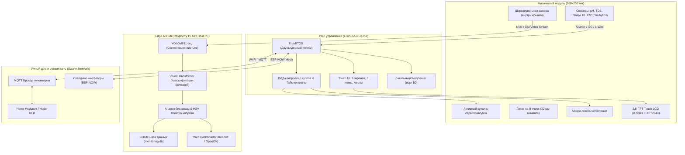

# 🌱 AgroHomeSystem: Автономный модульный агро-инкубатор с машинным зрением

<div align="center">


<br/>

**Компактная роботизированная экосистема прецизионного выращивания микрозелени, проращивания семян и черенкования на основе гидропоники периодического затопления, локального сенсорного контроля и нейросетевой аналитики здоровья растений.**

[О проекте](#-о-проекте) • [Ключевые инновации](#-ключевые-инновации) • [Архитектура](#-архитектура-системы) • [Механика и 3D-конструкция](#-механика-и-3d-конструкция) • [Гидропоника и сенсоры](#-гидропоника-и-сенсорная-подсистема) • [Прошивка ESP32-S3](#-прошивка-и-интерфейс-esp32-s3) • [Компьютерное зрение](#-компьютерное-зрение-и-edge-ai) • [Роевая ферма (Swarm)](#-масштабируемость-и-swarm-farming) • [Быстрый старт](#-быстрый-старт)

</div>

---

## 📌 О проекте

**AgroHomeSystem** — это автономный программно-аппаратный комплекс (инкубатор), созданный для решения фундаментальных проблем традиционного закрытого растениеводства: высоких трудозатрат, нестабильности микроклимата, шума вентиляционных установок и позднего обнаружения болезней растений.

Устройство выполнено в ультракомпактном форм-факторе **260×200 мм** и оснащено **8 изолированными посадочными ячейками**. В каждой ячейке поддерживается контролируемая среда для корневой зоны и листового аппарата.

```
┌────────────────────────────────────────────────────────────────────────┐
│                        AGROHOMESYSTEM ECOSYSTEM                        │
├─────────────────────────┬─────────────────────────┬────────────────────┤
│   🤖 РОБОТИЗИРОВАННЫЙ   │     🌊 ГИДРОПОНИКА     │   👁️ КОМПЬЮТЕРНОЕ  │
│       МИКРОКЛИМАТ       │      EBB & FLOW         │        ЗРЕНИЕ      │
│  ПИД-купол с серво /    │ Автоматическое          │ YOLOv8/11-seg +    │
│  NEMA17 проветриванием  │ периодическое           │ Vision Transformer │
│  вместо шумных кулеров  │ затопление 8 ячеек      │ (ViT) диагностика  │
├─────────────────────────┼─────────────────────────┼────────────────────┤
│   🖥️ ESP32-S3 TOUCH UI │    📈 ТЕЛЕМЕТРИЯ И VPD  │  🐝 SWARM FARMING  │
│  TFT 320x240, жесты,    │ pH, TDS, VPD, t° воды,  │ Роевое объединение │
│  3 темы, Web-сервер     │ t° воздуха, влажность   │ по MQTT & ESP-NOW  │
└─────────────────────────┴─────────────────────────┴────────────────────┘
```

---

## 💡 Ключевые инновации

### 1. Активный динамический купол с ПИД-проветриванием
В классических гроубоксах используются шумные вентиляторы, которые создают сквозняки, сушат листья и потребляют избыточную энергию. В **AgroHomeSystem** крышка модуля соединена с сервоприводом высокого крутящего момента (или шаговым двигателем NEMA 17). ПИД-регулятор микроконтроллера приоткрывает купол на строго выверенный угол, обеспечивая плавную конвекцию и удаление избытка тепла/влажности без вибраций и шума.

### 2. Прецизионное периодическое затопление (Ebb & Flow)
Корневая система каждого растения размещается в индивидуальных пробках из минеральной ваты 22 мм. Встроенная микропомпа подает питательный раствор в верхний лоток, равномерно затапливая все 8 ячеек на 15 минут, после чего раствор самотеком сливается обратно в нижний резервуар, естественным образом насыщая корни кислородом (аэрация без шумного компрессора).

### 3. Двухстадийный Edge AI пайплайн диагностики
Широкоугольная камера на внутренней стороне крышки делает снимки всей посадочной площади. Нейросетевой модуль выполняет:
1. **Сегментацию объектов (YOLOv8/11 Nano Segmentation):** маскирует полезную площадь листьев, отсекая фон лотка и субстрат (повышает точность классификации болезней на 40%).
2. **Диагностику патологий (Vision Transformer):** классифицирует ранние стадии фитофтороза, септориоза, мучнистой росы, ржавчины и пятнистости.
3. **Оценку биомассы и хлороза:** в режиме реального времени считает площадь зеленой массы (Green Biomass px²) для каждой из 8 ячеек и анализирует спектральный баланс RGB/HSV.

---

## 🏗️ Архитектура системы

Общая схема взаимодействия аппаратных модулей, локального контроллера и сервера аналитики:



---

## 📐 Механика и 3D-конструкция

Все механические элементы спроектированы для быстрого аддитивного производства (3D-печать пластиками PETG / ABS / ASA, стойкими к ультрафиолету и влажной среде) и параметризированы в **Компас-3D** и формате **STEP**:

| 3D-модель (STEP в `hardware/cad/step/`) | Назначение детали | Особенности конструкции |
|:---|:---|:---|
| **`Корпус нижняя часть.stp`** | Базовый корпус-резервуар (260×200 мм) | Двойное дно: отсек гидропонного раствора + дренажный уклон. Интегрированные посадочные места под помпу и датчики. |
| **`Крышка - Деталь.stp`** | Активный прозрачный/светозащитный купол | Крепление широкоугольной камеры, аэродинамические направляющие проветривания, проушины петель. |
| **`22мм .stp`** / **`22 мм мин вата.stp`** | Посадочные картриджи ячеек | 8 мест под стандартные субстратные кубики и пробки диаметром 22 мм (минеральная вата Grodan / кокосовые пробки). |
| **`держатель.stp`** | Кронштейн привода и сенсорной корзины | Универсальное крепление для сервопривода купола и платы контроллера. |
| **`угол.stp`** | Силовые угловые замки | Фиксация геометрии лотка, предотвращение деформаций при термоциклировании. |
| **`Штырь 10мм / 9мм - Деталь.stp`** | Оси поворотных петель крышки | Износостойкие поворотные штифты с фиксацией без люфтов. |

```
                 Крышка с камерой и серво-приводом
                    ┌─────────────────────────┐  ◄── Открытие по ПИД
                   ╱                         ╱│      на угол 0°..65°
                  ┌─────────────────────────┐ │
                  │  [ 1 ][ 2 ][ 3 ][ 4 ]   │ │  ◄── 8 ячеек (22 мм)
                  │  [ 5 ][ 6 ][ 7 ][ 8 ]   │ │
                  ├─────────────────────────┤ │
                  │ Резервуар Ebb & Flow    │╱   ◄── Габариты: 260 х 200 мм
                  └─────────────────────────┘
```

---

## 💧 Гидропоника и сенсорная подсистема

Система реализует автоматический замкнутый цикл гидропонного питания **Ebb and Flow**:

### Логика работы гидропоники:
1. **Фаза затопления (15 минут):** Микропомпа поднимает питательный раствор из нижнего бака в зону корней 8 ячеек. Корни минераловатных пробок напитываются сбалансированным раствором.
2. **Фаза аэрации / осушения (45 минут):** Помпа отключается, раствор самотеком возвращается в нижний резервуар через калиброванные сливные отверстия. Возникает эффект «поршня»: отступающая жидкость затягивает свежий кислород внутрь пор субстрата.
3. **Ручной полив питомца:** Возможность принудительного включения полива с сенсорного экрана с защитным таймером автоотключения (5 секунд).

### Контролируемые параметры среды:
* **pH раствора:** целевой диапазон **5.5 – 6.8** (контроль кислотно-щелочного баланса).
* **TDS / EC (Минерализация):** целевой диапазон **650 – 950 ppm** (контроль солей питания).
* **Температура раствора:** целевой диапазон **18.0 – 25.0 °C** (предотвращение загнивания корней).
* **Температура воздуха:** целевой диапазон **19.0 – 27.0 °C**.
* **Относительная влажность воздуха:** целевой диапазон **45.0 – 70.0 %**.
* **Дефицит упругости водяного пара (VPD):** целевой диапазон **0.8 – 1.2 кПа**. 
  
> [!TIP]
> **VPD (Vapor Pressure Deficit)** вычисляется алгоритмом прошивки на основе уравнения Тетенса. Это ключевой маркер транспирации: при низком VPD растение не способно испарять влагу, при высоком — испытывает стресс увядания.

---

## 💻 Прошивка и интерфейс ESP32-S3

Прошивка микроконтроллера разработана в среде **PlatformIO (Arduino Framework / FreeRTOS)** для чипа **ESP32-S3 DevKitM-1** (`firmware/src/main.cpp`).

### 📱 Сенсорный графический интерфейс (GUI):
* **Дисплей:** 2.8-дюймовый SPI TFT 320×240 (ILI9341) с резистивной тач-панелью XPT2046 на раздельных шинах HSPI/FSPI.
* **Движок распознавания жестов:** поддержка одиночных касаний (Tap) и свайпов (Swipe Up / Down / Left / Right) для быстрого перелистывания экранов.
* **Система динамических тем (Theme Engine):**
  * `Cyber Emerald` — высококонтрастный неоново-зеленый кибер-стиль;
  * `Nordic Ice` — спокойная арктическая ледяная палитра;
  * `Solar Amber` — теплый янтарно-солнечный стиль.
* **10 интерактивных экранов:**
  1. `SCR_HOME` — Главный дашборд с анимированным потоком помпы, плитками параметров и индикатором общего здоровья AI;
  2. `SCR_DETAIL` — Интерактивные графики истории параметров (24 точки) с переключением периодов (1ч / 6ч / 24ч);
  3. `SCR_SPROUT` — Виртуальный питомец-росток («Тамагочи»), синхронизированный с реальным прогрессом роста и диагнозом нейросети;
  4. `SCR_VISION` — **Выделенный экран Edge AI компьютерного зрения:** индекс здоровья (0–100%), многосегментный прогресс-бар роста (стадии: *Проросток → Вегетация → Цветение → Зрелость*), биомасса листьев, % хлороза и некроза, культура/патология, рекомендации агронома и кнопка съемки;
  5. `SCR_LAMP` — Управление спектром и ШИМ-яркостью фитоосвещения;
  6. `SCR_ADVISOR` — Встроенный агро-советник с рекомендациями по коррекции климата, питания и видеодиагностики;
  7. `SCR_GAME` — Аркадная мини-игра для интерактивного взаимодействия;
  8. `SCR_SETTINGS` — Калибровка тачскрина, выбор тем, режим «Demo Waves» (генератор синусоидальных колебаний датчиков);
  9. `SCR_WIFI_SCAN` — Поиск и сортировка доступных Wi-Fi сетей по уровню RSSI;
  10. `SCR_KBD` — Полноэкранная сенсорная QWERTY-клавиатура с переключением регистров для ввода паролей.
* **Двусторонний мост связи с Raspberry Pi 4:** USB-Serial (115200) и Wi-Fi REST API для непрерывной передачи аналитики и телеметрии.
* **Встроенный Web-сервер:** REST API и веб-дашборд на порту 80 с отображением Edge AI здоровья и прогресса роста растения.
* **3D-скринсейвер:** Анимированное звездное поле (Starfield) при 60 секундах бездействия для защиты матрицы от выгорания.

### 🔌 Распиновка ESP32-S3:
```
TFT MOSI  -> GPIO 11    │  TOUCH MOSI -> GPIO 6     │  PUMP RELAY  -> GPIO 16
TFT MISO  -> GPIO 13    │  TOUCH MISO -> GPIO 5     │  SERVO LID   -> GPIO 17
TFT SCK   -> GPIO 12    │  TOUCH SCK  -> GPIO 7     │  DHT22 SENS  -> GPIO 18
TFT CS    -> GPIO 10    │  TOUCH CS   -> GPIO 4     │  DS18B20 WT  -> GPIO 8
TFT DC    -> GPIO 9     │  PWM BL     -> GPIO 15    │  pH SENSOR   -> GPIO 1
TFT RST   -> GPIO 14    │                           │  TDS SENSOR  -> GPIO 2
```

---

## 👁️ Компьютерное зрение и Edge AI

В папке `demo/` реализован полный комплекс нейросетевой диагностики растений, оптимизированный для работы на одноплатных компьютерах (Raspberry Pi 4B) и рабочих станциях с CUDA.

```
       Входной видеопоток (Камера купола)
                      │
                      ▼
       ┌───────────────────────────────┐
       │     YOLOv8/11 Segmentation    │ ◄── Отсекает лоток и фон, выделяет
       │       (yolov8n-seg.pt)        │     маску листовой пластины
       └──────────────┬────────────────┘
                      │ Вырезанный сегмент листа
                      ▼
       ┌───────────────────────────────┐
       │   Vision Transformer (ViT)    │ ◄── AishaKanwal/ModelsViT_PlantDisease
       │  Классификация патологий      │     (Фитофтороз, Роса, Пятнистости)
       └──────────────┬────────────────┘
                      │
        ┌─────────────┴─────────────┐
        ▼                           ▼
┌──────────────────┐       ┌──────────────────┐
│ Анализ биомассы  │       │  Анализ спектра  │
│  (Green Area px) │       │   (HSV Хлороз)   │
└──────────────────┘       └──────────────────┘
```

### Поддерживаемые классы диагностики:
1. **Healthy (Здоровое растение)** — 100% точность распознавания чистых культур.
2. **Late Blight (Фитофтороз)** — *Phytophthora infestans*.
3. **Early Blight (Альтернариоз / Ранняя сухая пятнистость)** — *Alternaria solani*.
4. **Septoria Leaf Spot (Септориоз)** — *Septoria lycopersici*.
5. **Rust (Ржавчина растений)** — *Puccinia spp.*.
6. **Powdery Mildew (Мучнистая роса)** — *Erysiphales*.

### Готовые модули запуска:
* **`realtime_disease_detection.py`** — Автономное десктопное приложение OpenCV с наложением масок сегментации в реальном времени, FPS-счетчиком и горячими клавишами (`S` — сохранить снимок, `P` — пауза).
* **`web_interface.py`** — Интерактивный Web-интерфейс на **Streamlit** (потоковое видео, загрузка фотографий, настройка порогов уверенности, экспорт в CSV).
* **`monitoring_dashboard.py`** — Промышленный сервер мониторинга с базой данных **SQLite (`monitoring.db`)**, автогенерацией алертов и экспортом периодических аналитических отчетов в формате JSON.
* **`validate_accuracy.py`** & **`batch_plant_diagnosis.py`** — Пакетная валидация датасетов и оценка метрик точности модели.

---

## 🐝 Масштабируемость и Swarm Farming

Компактные размеры 260×200 мм делают AgroHomeSystem элементарным кирпичиком («ячейкой») для создания распределенных вертикальных ферм и стеллажных комплексов:

1. **Роевая синхронизация (ESP-NOW):** Модули на одном стеллаже координируют циклы полива, исключая одновременную пиковую нагрузку на общую гидромагистраль и электросеть.
2. **Интеграция с Home Assistant:** Каждый инкубатор автоматически публикует телеметрию и топики управления по MQTT (температура, pH, уровень открытия купола, индекс биомассы).
3. **Энергонезависимость:** Низкое энергопотребление контроллера ESP32-S3 и сервоприводов позволяет запитывать модуль от 12V аккумулятора и солнечных батарей в выездных лабораториях и теплицах.

---

## 📂 Структура репозитория

```
AgroHomeSystem/
├── README.md                       # Главная документация проекта
│
├── hardware/                       # Аппаратная часть и 3D-модели
│   ├── README.md                   # Спецификация 3D-деталей и настройки печати
│   └── cad/
│       ├── step/                   # Универсальные 3D-модели (STEP/STP)
│       │   ├── 22 мм мин вата.stp  # Субстратная пробка 22 мм
│       │   ├── 22мм .stp           # Посадочное гнездо ячейки
│       │   ├── Корпус нижняя часть.stp # Лоток-резервуар Ebb & Flow (260x200 мм)
│       │   ├── Крышка - Деталь.stp # Активный климатический купол
│       │   ├── держатель.stp       # Кронштейн сервопривода
│       │   ├── угол.stp            # Угловой силовой замок
│       │   ├── Штырь 10мм - Деталь.stp # Поворотная ось петли (10 мм)
│       │   └── Штырь 9мм - Деталь.stp  # Поворотная ось петли (9 мм)
│       └── kompas3d/               # Исходники проектов в Компас-3D (M3D)
│
├── firmware/                       # Прошивка ESP32-S3 (PlatformIO)
│   ├── README.md                   # Руководство по распиновке и прошивке
│   ├── platformio.ini              # Конфигурация платы и библиотек
│   ├── include/                    # Заголовочные файлы
│   └── src/
│       └── main.cpp                # Полный исходный код (FreeRTOS, GUI, Web, Sensors)
│
├── demo/                           # Нейросетевая аналитика (Edge AI & Computer Vision)
│   ├── requirements.txt            # Зависимости Python (PyTorch, YOLO, Transformers)
│   ├── realtime_disease_detection.py # OpenCV детектор реального времени
│   ├── web_interface.py            # Streamlit веб-приложение
│   ├── monitoring_dashboard.py     # Демон мониторинга с SQLite базой
│   ├── batch_plant_diagnosis.py    # Пакетная обработка изображений
│   ├── validate_accuracy.py        # Валидация точности на датасете
│   ├── gestures.py                 # Распознавание жестового управления
│   ├── setup_realtime.py           # Скрипт быстрой установки зависимостей
│   ├── yolov8n-seg.pt              # Веса YOLOv8 Nano сегментации
│   └── yolo11n-seg.pt              # Веса YOLO11 Nano сегментации
│
└── docs/                           # Общая проектная документация
    └── ARCHITECTURE.md             # Системная архитектура и диаграммы
```

---

## 🚀 Быстрый старт

### 1. Сборка и прошивка микроконтроллера (ESP32-S3)
1. Установите [VS Code](https://code.visualstudio.com/) и расширение **PlatformIO IDE**.
2. Откройте директорию `firmware/`.
3. Подключите плату ESP32-S3 DevKit через USB к порту `UART` / `USB-CDC`.
4. Соберите и загрузите прошивку:
   ```bash
   pio run --target upload
   ```
5. При первом включении выполните быструю 4-точечную калибровку тачскрина на дисплее.

### 2. Запуск системы машинного зрения (Edge AI)
1. Перейдите в каталог `demo/`:
   ```bash
   cd demo
   ```
2. Создайте виртуальное окружение и установите зависимости:
   ```bash
   python -m venv venv
   # Windows:
   .\venv\Scripts\activate
   # Linux / macOS:
   source venv/bin/activate

   pip install -r requirements.txt  # или python setup_realtime.py
   ```
3. Запустите желаемый режим работы:
   * **Десктопное окно с камерой:** `python realtime_disease_detection.py`
   * **Веб-дашборд Streamlit:** `streamlit run web_interface.py`
   * **Сервер непрерывного мониторинга:** `python monitoring_dashboard.py`

---

## 🗺️ Дорожная карта (Roadmap)

- [x] Разработка 3D-моделей корпуса (260×200 мм) и активной крышки в Компас-3D.
- [x] Создание гидропонной схемы периодического затопления на 8 мест.
- [x] Реализация прошивки ESP32-S3 с тач-интерфейсом, темами, графиками и Web-сервером.
- [x] Интеграция YOLOv8/11 сегментации и Vision Transformer классификации патологий.
- [x] Создание SQLite логгера телеметрии и Streamlit дашборда.
- [ ] Интеграция автоматических перистальтических дозаторов pH Up / pH Down.
- [ ] Обучение специализированного легкого трансформера на спектральный анализ дефицита азота (N), фосфора (P), калия (K).
- [ ] Мобильное приложение Flutter с поддержкой WebRTC видеопотока из инкубатора.

---

## 📜 Лицензия

Проект распространяется под комбинированной лицензией:
* Аппаратная часть, прошивка и архитектура — **MIT License**.
* Модели компьютерного зрения (YOLO / Transformers) — в соответствии с оригинальными лицензиями **Ultralytics AGPL-3.0** и **Apache 2.0**.

---

<div align="center">
  Разработано с заботой о растениях 🌿 • <b>AgroHomeSystem 2026</b>
</div>
