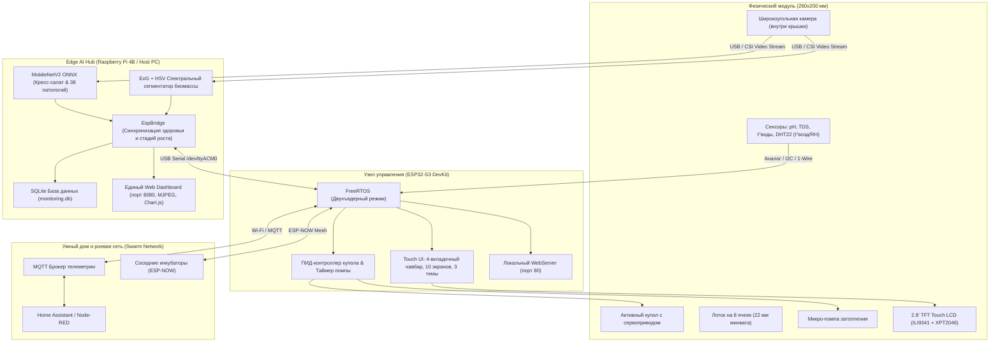

# 🌱 AgroHomeSystem: Автономный модульный агро-инкубатор с машинным зрением

<div align="center">


<br/>

**Компактная роботизированная экосистема прецизионного выращивания микрозелени, проращивания семян и черенкования на основе гидропоники периодического затопления, локального сенсорного контроля и нейросетевой аналитики здоровья растений.**

[О проекте](#-о-проекте) • [Ключевые инновации](#-ключевые-инновации) • [Архитектура](#-архитектура-системы) • [Механика и 3D-конструкция](#-механика-и-3d-конструкция) • [Гидропоника и сенсоры](#-гидропоника-и-сенсорная-подсистема) • [Прошивка ESP32-S3](#-прошивка-и-интерфейс-esp32-s3) • [Компьютерное зрение](#-компьютерное-зрение-и-edge-ai) • [Роевая ферма (Swarm)](#-масштабируемость-и-swarm-farming) • [Быстрый старт](#-быстрый-старт)

</div>

---

## 📌 О проекте

**AgroHomeSystem** — это автономный программно-аппаратный комплекс (инкубатор), созданный для решения фундаментальных проблем традиционного закрытого растениеводства: высоких трудозатрат, нестабильности микроклимата, шума вентиляционных установок и позднего обнаружения болезней растений.

Устройство выполнено в ультракомпактном форм-факторе **260×200 мм** и оснащено **8 изолированными посадочными ячейками**. В каждой ячейке поддерживается контролируемая среда для корневой зоны и листового аппарата.

```
┌────────────────────────────────────────────────────────────────────────┐
│                        AGROHOMESYSTEM ECOSYSTEM                        │
├─────────────────────────┬─────────────────────────┬────────────────────┤
│   🤖 РОБОТИЗИРОВАННЫЙ   │     🌊 ГИДРОПОНИКА     │   👁️ КОМПЬЮТЕРНОЕ  │
│       МИКРОКЛИМАТ       │      EBB & FLOW         │        ЗРЕНИЕ      │
│  ПИД-купол с серво /    │ Автоматическое          │ MobileNetV2 ONNX + │
│  NEMA17 проветриванием  │ периодическое           │ ExG биофизический  │
│  вместо шумных кулеров  │ затопление 8 ячеек      │ анализ болезней    │
├─────────────────────────┼─────────────────────────┼────────────────────┤
│   🖥️ ESP32-S3 TOUCH UI │    📈 ТЕЛЕМЕТРИЯ И VPD  │  🐝 SWARM FARMING  │
│  TFT 320x240, 4 вкладки │ pH, TDS, VPD, t° воды,  │ Роевое объединение │
│  AI экран, сброс уровня │ t° воздуха, влажность   │ по MQTT & ESP-NOW  │
└─────────────────────────┴─────────────────────────┴────────────────────┘
```

---

## 💡 Ключевые инновации

### 1. Активный динамический купол с ПИД-проветриванием
В классических гроубоксах используются шумные вентиляторы, которые создают сквозняки, сушат листья и потребляют избыточную энергию. В **AgroHomeSystem** крышка модуля соединена с сервоприводом высокого крутящего момента (или шаговым двигателем NEMA 17). ПИД-регулятор микроконтроллера приоткрывает купол на строго выверенный угол, обеспечивая плавную конвекцию и удаление избытка тепла/влажности без вибраций и шума.

### 2. Прецизионное периодическое затопление (Ebb & Flow)
Корневая система каждого растения размещается в индивидуальных пробках из минеральной ваты 22 мм. Встроенная микропомпа подает питательный раствор в верхний лоток, равномерно затапливая все 8 ячеек на 15 минут, после чего раствор самотеком сливается обратно в нижний резервуар, естественным образом насыщая корни кислородом (аэрация без шумного компрессора).

### 3. Двухстадийный Edge AI пайплайн диагностики и пресеты культур
Широкоугольная камера на внутренней стороне крышки делает снимки всей посадочной площади. Нейросетевой модуль выполняет:
1. **Специализированные пресеты культур (`CropPreset`):** динамическая настройка оптимальных гидропонных диапазонов (pH, TDS, температура воды/воздуха, VPD) и Байесовское взвешивание классов.
2. **Специализированная модель для микрозелени Кресс-салата (MobileNetV2 Watercress Edition, ONNX):** высокоточная классификация фаз развития (*Прорастание семян → Семядоли → Спелая микрозелень*) и опасных патологий (*Черная ножка Pythium, Серая гниль Botrytis, Хлороз Fe/N, Краевой ожог TDS*).
3. **Биофизический спектральный сегментатор (ExG + HSV):** вычисляет площадь полога, индексы здорового хлорофилла, процент хлороза, некроза и очагов мицелия плесени в реальном времени (1–3 мс на CPU).
4. **Универсальная классификация 38 патологий (MobileNetV2 / ViT):** диагностика томата, перца, ягодных и пряных трав в режиме авто-определения.

---

## 🏗️ Архитектура системы

Общая схема взаимодействия аппаратных модулей, локального контроллера и сервера аналитики:



---

## 📐 Механика и 3D-конструкция

Все механические элементы спроектированы для быстрого аддитивного производства (3D-печать пластиками PETG / ABS / ASA, стойкими к ультрафиолету и влажной среде) и параметризированы в **Компас-3D** и формате **STEP**:

| 3D-модель (STEP в `hardware/cad/step/`) | Назначение детали | Особенности конструкции |
|:---|:---|:---|
| **`Корпус нижняя часть.stp`** | Базовый корпус-резервуар (260×200 мм) | Двойное дно: отсек гидропонного раствора + дренажный уклон. Интегрированные посадочные места под помпу и датчики. |
| **`Крышка - Деталь.stp`** | Активный прозрачный/светозащитный купол | Крепление широкоугольной камеры, аэродинамические направляющие проветривания, проушины петель. |
| **`22мм .stp`** / **`22 мм мин вата.stp`** | Посадочные картриджи ячеек | 8 мест под стандартные субстратные кубики и пробки диаметром 22 мм (минеральная вата Grodan / кокосовые пробки). |
| **`держатель.stp`** | Кронштейн привода и сенсорной корзины | Универсальное крепление для сервопривода купола и платы контроллера. |
| **`угол.stp`** | Силовые угловые замки | Фиксация геометрии лотка, предотвращение деформаций при термоциклировании. |
| **`Штырь 10мм / 9мм - Деталь.stp`** | Оси поворотных петель крышки | Износостойкие поворотные штифты с фиксацией без люфтов. |

```
                 Крышка с камерой и серво-приводом
                    ┌─────────────────────────┐  ◄── Открытие по ПИД
                   ╱                         ╱│      на угол 0°..65°
                  ┌─────────────────────────┐ │
                  │  [ 1 ][ 2 ][ 3 ][ 4 ]   │ │  ◄── 8 ячеек (22 мм)
                  │  [ 5 ][ 6 ][ 7 ][ 8 ]   │ │
                  ├─────────────────────────┤ │
                  │ Резервуар Ebb & Flow    │╱   ◄── Габариты: 260 х 200 мм
                  └─────────────────────────┘
```

---

## 💧 Гидропоника и сенсорная подсистема

Система реализует автоматический замкнутый цикл гидропонного питания **Ebb and Flow**:

### Логика работы гидропоники:
1. **Фаза затопления (15 минут):** Микропомпа поднимает питательный раствор из нижнего бака в зону корней 8 ячеек. Корни минераловатных пробок напитываются сбалансированным раствором.
2. **Фаза аэрации / осушения (45 минут):** Помпа отключается, раствор самотеком возвращается в нижний резервуар через калиброванные сливные отверстия. Возникает эффект «поршня»: отступающая жидкость затягивает свежий кислород внутрь пор субстрата.
3. **Ручной полив питомца:** Возможность принудительного включения полива с сенсорного экрана с защитным таймером автоотключения (5 секунд).

### Контролируемые параметры среды:
* **pH раствора:** целевой диапазон **5.5 – 6.8** (контроль кислотно-щелочного баланса).
* **TDS / EC (Минерализация):** целевой диапазон **400 – 950 ppm** (контроль солей питания).
* **Температура раствора:** целевой диапазон **18.0 – 22.0 °C** (предотвращение загнивания корней).
* **Температура воздуха:** целевой диапазон **19.0 – 25.0 °C**.
* **Относительная влажность воздуха:** целевой диапазон **50.0 – 70.0 %**.
* **Дефицит упругости водяного пара (VPD):** целевой диапазон **0.6 – 1.1 кПа**. 
  
> [!TIP]
> **VPD (Vapor Pressure Deficit)** вычисляется алгоритмом прошивки на основе уравнения Тетенса. Это ключевой маркер транспирации: при низком VPD растение не способно испарять влагу, при высоком — испытывает стресс увядания.

---

## 💻 Прошивка и интерфейс ESP32-S3

Прошивка микроконтроллера разработана в среде **PlatformIO (Arduino Framework / FreeRTOS)** для чипа **ESP32-S3 DevKitM-1** (`firmware/src/main.cpp`).

### 📱 Сенсорный графический интерфейс (GUI):
* **Дисплей:** 2.8-дюймовый SPI TFT 320×240 (ILI9341) с резистивной тач-панелью XPT2046 на раздельных шинах HSPI/FSPI.
* **4-вкладочный нижний навбар:**
  * **Таб 0:** `[МОНИТОР]` — гидропоника, датчики pH/TDS/климата, помпа.
  * **Таб 1:** `[ИИ ЗРЕНИЕ]` — **полноценная отдельная вкладка данных от Raspberry Pi**: статус здоровья, 4-сегментный прогресс-бар фаз роста, проценты биомассы/хлороза/некроза, диагноз и агро-рекомендации.
  * **Таб 2:** `[РОСТОК]` — виртуальный питомец («Тамагочи»), забота, полив, **кнопка сброса уровня прогресса**.
  * **Таб 3:** `[НАСТРОЙКИ]` — темы, Wi-Fi, демо-режим, выбор языка (RU/EN).
* **Система динамических тем:** `Cyber Emerald`, `Nordic Ice`, `Solar Amber`.
* **Двусторонний мост связи с Raspberry Pi 4:** USB-Serial (115200) и Wi-Fi REST API для непрерывной передачи аналитики и телеметрии.
* **Встроенный Web-сервер:** REST API и веб-дашборд на порту 80.
* **3D-скринсейвер:** Анимированное звездное поле (Starfield) при 60 секундах бездействия для защиты матрицы от выгорания.

### 🔌 Распиновка ESP32-S3:
```
TFT MOSI  -> GPIO 11    │  TOUCH MOSI -> GPIO 6     │  PUMP RELAY  -> GPIO 16
TFT MISO  -> GPIO 13    │  TOUCH MISO -> GPIO 5     │  SERVO LID   -> GPIO 17
TFT SCK   -> GPIO 12    │  TOUCH SCK  -> GPIO 7     │  DHT22 SENS  -> GPIO 18
TFT CS    -> GPIO 10    │  TOUCH CS   -> GPIO 4     │  DS18B20 WT  -> GPIO 8
TFT DC    -> GPIO 9     │  PWM BL     -> GPIO 15    │  pH SENSOR   -> GPIO 1
TFT RST   -> GPIO 14    │                           │  TDS SENSOR  -> GPIO 2
```

---

## 👁️ Компьютерное зрение и Edge AI

В папке `demo/` реализован полный комплекс нейросетевой диагностики растений, оптимизированный для работы на одноплатных компьютерах (Raspberry Pi 4B / ARM NEON) и рабочих станциях с CUDA.

```
       Входной видеопоток (Камера купола / CSI / USB)
                              │
                              ▼
        ┌───────────────────────────────────────────┐
        │  Foliage & Canopy Segmenter (ExG + HSV)   │ ◄── Отсекает субстрат/лоток (1-3 мс CPU),
        │  Вычисление биомассы, хлороза, некроза    │     детектор серой гнили (Botrytis)
        └─────────────────────┬─────────────────────┘
                              │
                              ▼
        ┌───────────────────────────────────────────┐
        │  Crop Presets & Bayesian Prior Weighting  │ ◄── Пресеты: Кресс-салат, Томат,
        │  (Фильтрация ложных кросс-срабатываний)   │     Перец, Клубника, Базилик, Авто
        └─────────────────────┬─────────────────────┘
                              │
                              ▼
        ┌───────────────────────────────────────────┐
        │     MobileNetV2 Watercress Edition ONNX   │ ◄── Обученная модель (8.49 МБ, 1.24 мс):
        │     + Универсальная модель 38 патологий   │     Всходы, Семядоли, Спелость, Черная ножка
        └─────────────────────┬─────────────────────┘
                              │
                              ▼
        ┌───────────────────────────────────────────┐
        │   EspBridge Protocol (Синхронизация RPi)  │ ◄── Передача диагноза, % здоровья и
        │   + Единый Web Dashboard (порт 8080)      │     стадии роста на экран ESP32-S3
        └───────────────────────────────────────────┘
```

### Поддерживаемые классы и профили культур:
1. **🌱 Пресет «Кресс-салат» (*Lepidium sativum*):**
   * `Watercress_Germination` — Прорастание семян и появление корешков (Дни 1–3).
   * `Watercress_Healthy_Cotyledons` — Фаза сочных изумрудных семядолей (Дни 4–6).
   * `Watercress_Healthy_Mature` — Спелый ковер микрозелени, готовый к срезке (Дни 7–12).
   * `Watercress_Damping_Off` — Черная ножка и полегание всходов (*Pythium ultimum*).
   * `Watercress_Mold` — Серая гниль и мицелий плесени (*Botrytis cinerea*).
   * `Watercress_Chlorosis` — Хлороз микрозелени (Дефицит железа/азота при pH > 6.8).
   * `Watercress_Tip_Burn` — Краевой ожог листьев при засолении (TDS > 850 ppm).
2. **🍅 Пресет «Томат Черри»** (*Solanum lycopersicum*).
3. **🫑 Пресет «Сладкий перец»** (*Capsicum annuum*).
4. **🍓 Пресет «Клубника/Земляника»** (*Fragaria ananassa*).
5. **🌿 Пресет «Базилик»** (*Ocimum basilicum*).
6. **🤖 Универсальный режим «Авто»:** идентификация 38 заболеваний растений (PlantVillage Dataset).

### Готовые модули запуска:
* **`web_dashboard.py`** — Единый высокопроизводительный веб-дашборд на порту 8080 (MJPEG видеопоток, выбор пресета культуры, сброс уровня ростка, телеметрия SQLite).
* **`plant_health_engine.py`** — Мультимодальный движок анализа здоровья растений (ExG сегментация + MobileNetV2 ONNX классификатор).
* **`simulate_bridge.py`** — Эмулятор жизненного цикла культуры и синхронизации ESP32-S3 с Raspberry Pi через Serial `/dev/ttyACM0`.
* **`flash_esp.py`** — Утилита автоматической прошивки бинарника ESP32 прямо из консоли Raspberry Pi.
* **`train_watercress_model.py`** — Скрипт дообучения MobileNetV2 на GPU с экспортом в ONNX.
* **`realtime_disease_detection.py`** — Десктопное окно OpenCV с визуализацией сегментации в реальном времени.

---

## 🐝 Масштабируемость и Swarm Farming

Компактные размеры 260×200 мм делают AgroHomeSystem элементарным кирпичиком («ячейкой») для создания распределенных вертикальных ферм и стеллажных комплексов:

1. **Роевая синхронизация (ESP-NOW):** Модули на одном стеллаже координируют циклы полива, исключая одновременную пиковую нагрузку на общую гидромагистраль и электросеть.
2. **Интеграция с Home Assistant:** Каждый инкубатор автоматически публикует телеметрию и топики управления по MQTT (температура, pH, уровень открытия купола, индекс биомассы).
3. **Энергонезависимость:** Низкое энергопотребление контроллера ESP32-S3 и сервоприводов позволяет запитывать модуль от 12V аккумулятора и солнечных батарей в выездных лабораториях и теплицах.

---

## 📂 Структура репозитория

```
AgroHomeSystem/
├── README.md                           # Главная документация проекта
│
├── hardware/                           # Аппаратная часть и 3D-модели
│   ├── README.md                       # Спецификация 3D-деталей и настройки печати
│   └── cad/
│       ├── step/                       # Универсальные 3D-модели (STEP/STP)
│       │   ├── 22 мм мин вата.stp      # Субстратная пробка 22 мм
│       │   ├── 22мм .stp               # Посадочное гнездо ячейки
│       │   ├── Корпус нижняя часть.stp # Лоток-резервуар Ebb & Flow (260x200 мм)
│       │   ├── Крышка - Деталь.stp     # Активный климатический купол
│       │   ├── держатель.stp           # Кронштейн сервопривода
│       │   ├── угол.stp                # Угловой силовой замок
│       │   ├── Штырь 10мм - Деталь.stp # Поворотная ось петли (10 мм)
│       │   └── Штырь 9мм - Деталь.stp  # Поворотная ось петли (9 мм)
│       └── kompas3d/                   # Исходники проектов в Компас-3D (M3D)
│
├── firmware/                           # Прошивка ESP32-S3 (PlatformIO)
│   ├── README.md                       # Руководство по распиновке и прошивке
│   ├── platformio.ini                  # Конфигурация платы и библиотек
│   ├── bin/firmware.bin                # Скомпилированный бинарник для быстрой прошивки
│   ├── include/                        # Заголовочные файлы
│   └── src/
│       └── main.cpp                    # Полный исходный код (FreeRTOS, 4-таб GUI, Web, Sensors)
│
├── demo/                               # Нейросетевая аналитика (Edge AI & Computer Vision)
│   ├── requirements.txt                # Зависимости Python (ONNX Runtime, OpenCV, PyTorch)
│   ├── web_dashboard.py                # Единый веб-дашборд и сервер мониторинга (порт 8080)
│   ├── plant_health_engine.py          # Мультимодальный движок диагностики культур
│   ├── simulate_bridge.py              # Эмулятор протокола синхронизации ESP32 <-> RPi
│   ├── flash_esp.py                    # Скрипт прошивки ESP32 с Raspberry Pi
│   ├── train_watercress_model.py       # Пайплайн дообучения MobileNetV2
│   ├── mobilenetv2_watercress.onnx     # Оптимизированная ONNX-модель для кресс-салата
│   ├── mobilenetv2_watercress.pt       # PyTorch веса обученной модели
│   ├── watercress_labels.json          # Метаданные классов кресс-салата
│   ├── real_test_dataset/              # Верифицированный датасет 100% настоящих фотографий
│   └── run_tests.py                    # Автоматизированный тестовый набор проекта
│
└── docs/                               # Общая проектная документация
    └── ARCHITECTURE.md                 # Системная архитектура и диаграммы
```

---

## 🚀 Быстрый старт на Raspberry Pi 4 и ПК

### 1. Подготовка и запуск на Raspberry Pi 4B

```bash
# Клонирование / обновление репозитория
cd ~/AgroHomeSystem
git pull origin main

# Установка зависимостей Python
cd demo
pip3 install -r requirements.txt

# 1. Прошивка подключенной по USB ESP32-S3 прямо с Raspberry Pi:
python3 flash_esp.py --port /dev/ttyACM0

# 2. Запуск единого веб-дашборда с камерой и мостом к ESP32:
python3 web_dashboard.py --esp-port /dev/ttyACM0 --port 8080
```
Дашборд доступен в браузере по адресу `http://<IP_RASPBERRY_PI>:8080`.

### 2. Тестирование и эмуляция жизненного цикла (без камеры)
```bash
# Запуск эмулятора жизненного цикла кресс-салата с передачей стадий на ESP32:
python3 simulate_bridge.py --port /dev/ttyACM0 --baud 115200 --preset watercress --repeat

# Запуск набора автоматизированных тестов:
python3 run_tests.py
```

---

## 🗺️ Дорожная карта (Roadmap)

- [x] Разработка 3D-моделей корпуса (260×200 мм) и активной крышки в Компас-3D.
- [x] Создание гидропонной схемы периодического затопления на 8 мест.
- [x] Реализация прошивки ESP32-S3 с тач-интерфейсом, темами, графиками и Web-сервером.
- [x] Выделенный экран ИИ Зрения и функция сброса уровня ростка-питомца на ESP32.
- [x] Обучение и экспорт легковесной модели MobileNetV2 ONNX для микрозелени кресс-салата.
- [x] Создание SQLite логгера телеметрии и единого Web-дашборда на порту 8080.
- [x] Валидация алгоритмов на 100% реальных снимках фитопатологий и стадий роста.
- [ ] Интеграция автоматических перистальтических дозаторов pH Up / pH Down.
- [ ] Мобильное приложение Flutter с поддержкой WebRTC видеопотока из инкубатора.

---

## 📜 Лицензия

Проект распространяется под комбинированной лицензией:
* Аппаратная часть, прошивка и архитектура — **MIT License**.
* Модели компьютерного зрения — в соответствии с лицензиями **Apache 2.0**.

---

<div align="center">
  Разработано с заботой о растениях 🌿 • <b>AgroHomeSystem 2026</b>
</div>
